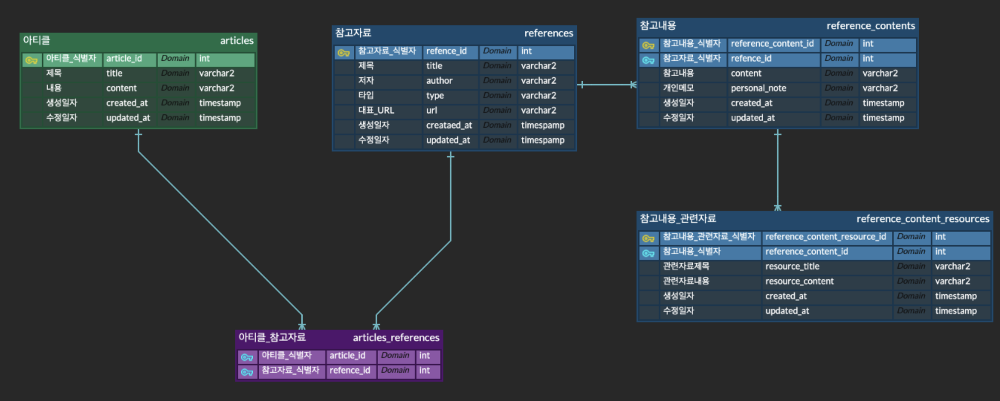

# spring_portfolio

### 미션 내역

#### [미션2] 테이블 설계하기 

[미션2 링크](#https://www.erdcloud.com/d/RdWWu5viCrwkqxxkC)

* 앞으로 작성할 인용 문구 혹은 인용할 url을 db에 저장하기 위해 작성하였습니다.

#### [미션3] 테이블 설계하기 

### 1️⃣ Article
|     기능      | Method | URL                   | 설명          |
| :-----------: | :----: | :-------------------- | :------------ |
|     등록      |  POST  | /articles             | 아티클 등록   |
|     조회      |  GET   | /articles/{articleId} | 아티클 조회   |
|     수정      |  PUT   | /articles             | 아티클 수정   |
|     삭제      | DELETE | /articles             | 아티클 삭제   |
| 참고자료 등록 |  POST  | /articles/references  | 참고자료 등록 |
| 참고자료 삭제 | DELETE | /articles/references  | 참고자료 삭제 |

### 2️⃣  References Content
|     기능      | Method | URL                                | 설명                    |
| :-----------: | :----: | :--------------------------------- | :---------------------- |
|     등록      |  POST  | /references/contents               | 참고 내용 등록          |
|     조회      |  GET   | /references/contents/{referenceId} | 참고 내용 조회          |
|     수정      |  PUT   | /references/contents               | 참고 내용 수정          |
|     삭제      | DELETE | /references/contents               | 참고 내용 삭제          |
| 관련자료 등록 |  POST  | /references/contents/resources     | 참고 내용 관련자료 등록 |
| 관련자료 삭제 | DELETE | /references/contents/resources     | 참고 내용 관련자료 삭제 |

#### [미션4] 조회 REST API 만들기 제출 스레드

